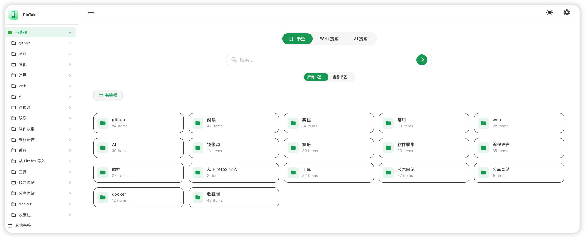

<p align="center">  </p>

# PinTab

[中文](README.md) | [English](README_en.md)

PinTab is an open-source new tab browser extension, built upon [PintreeNewTab](https://github.com/tangxiaoqi-tangxiao/PintreeNewTab.git).

It transforms your browser bookmarks into a clean, clear, and easy-to-use navigation page, turning bookmarks that were previously difficult to manage and browse into your personal new tab homepage.



## Features

- Displays browser bookmarks as a new tab navigation page
- Automatically reads and displays browser bookmarks
- Supports multi-level bookmark folder structures
- Clean interface, suitable as a daily homepage
- Automatically switches UI language based on browser language
- Open source, lightweight, easy to run locally and customize

## Supported Languages

- Simplified Chinese
- English

## Local Development

### Prerequisites

Node.js v20 or higher is recommended.

### Install Dependencies

```bash
pnpm install
```

### Start Development Server

```bash
pnpm run dev
```

After running, the project will automatically open the browser and install the development version of the extension.
Code changes will automatically reload the extension for easy debugging.

## Build

Run the following command to package the project:

```bash
pnpm run build
```

The packaged files will be generated in the `.output` directory.

## Roadmap

- Improve bookmark display styles
- Support more customization options
- Optimize mobile display
- Enhance bookmark search capabilities
- Improve i18n coverage

## Acknowledgments

This project is built upon [PintreeNewTab](https://github.com/tangxiaoqi-tangxiao/PintreeNewTab.git). Thanks to the original project for providing an excellent foundation and design.
